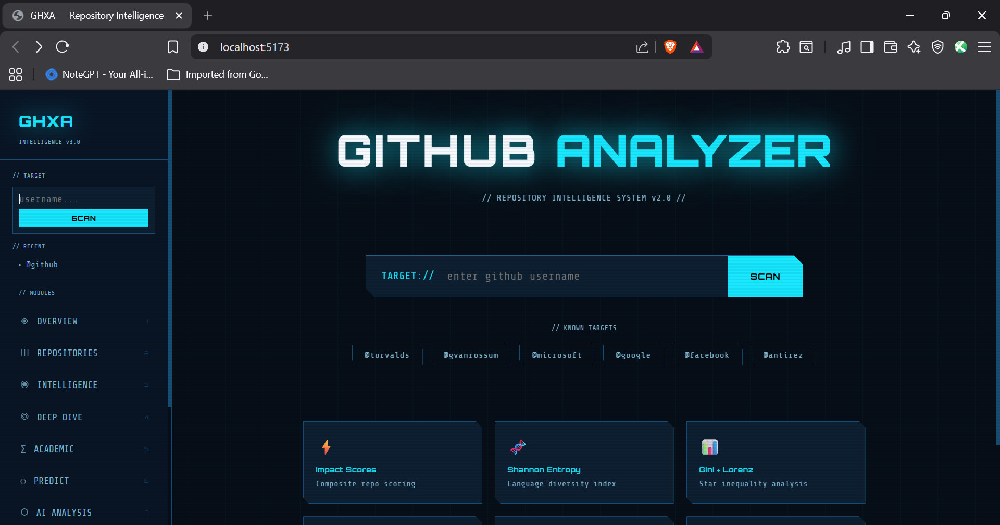

# GHXA — GitHub Repository Intelligence System

> *GitHub shows you what someone built. GHXA shows you who they are.*

A full-stack developer intelligence platform that applies information theory, economic inequality metrics, statistical forecasting, and AI analysis to any public GitHub profile.



---

## What Makes This Different From GitHub

| Feature | GitHub | GHXA |
|---|---|---|
| Star / Fork counts | ✓ | ✓ |
| Impact Score per repo | ✗ | ✓ |
| Shannon Entropy (language diversity) | ✗ | ✓ |
| Gini Coefficient + Lorenz Curve | ✗ | ✓ |
| Zipf's Law power law fit | ✗ | ✓ |
| Benford's Law χ² analysis | ✗ | ✓ |
| Kolmogorov Complexity proxy | ✗ | ✓ |
| K-Means Clustering (pure NumPy) | ✗ | ✓ |
| Pearson Correlation Matrix | ✗ | ✓ |
| Z-Score outlier detection | ✗ | ✓ |
| Developer Archetype classification | ✗ | ✓ |
| Tech Debt score per repo | ✗ | ✓ |
| Commit Velocity + OLS forecast | ✗ | ✓ |
| 24hr Productivity Clock heatmap | ✗ | ✓ |
| Star growth projections | ✗ | ✓ |
| AI Intelligence Report (Llama 3.3 70B) | ✗ | ✓ |
| AI Career Trajectory analysis | ✗ | ✓ |
| AI Roast Mode | ✗ | ✓ |
| Side-by-side developer battle | ✗ | ✓ |

---

## Pages

| Page | What it shows |
|---|---|
| **Home** | Animated search, known targets, feature grid |
| **Overview** | Profile, archetype, health ring, language evolution |
| **Repositories** | Sortable table — impact score, classification, tech debt |
| **Intelligence** | Shannon entropy, Gini + Lorenz curve, tech debt chart |
| **Deep Dive** | Commit sparklines, 24hr heatmap, star history |
| **Academic** | Zipf curve, Benford bars, Pearson heatmap, K-Means |
| **Predict** | Trajectory gauge, OLS regression forecast, star projections |
| **AI Analysis** | Intelligence report, career trajectory, roast mode |
| **Compare** | Radar chart, head-to-head table, overall verdict |

---

## Tech Stack

**Backend**
```
Python 3.x + Flask    REST API server
Pandas + NumPy        Data pipeline
SciPy                 Statistics (Pearson, Zipf, Benford, OLS)
Groq SDK              Llama 3.3 70B AI (free tier)
Requests              GitHub REST API
```

**Frontend**
```
React 18 + Vite       UI + build
React Router v6       9-page routing
Recharts              Charts (Line, Bar, Area, Radar)
Inter + Orbitron      Typography
```

---

## Setup

### 1. Clone

```bash
git clone https://github.com/SaakshiJatti/github-analyzer.git
cd github-analyzer
```

### 2. Backend

```bash
cd backend
python -m venv venv

# Windows
venv\Scripts\activate
# Mac/Linux
source venv/bin/activate

pip install -r requirements.txt
```

Create `backend/.env`:
```
GROQ_API_KEY=gsk_your_key_here
```

Get a **free** Groq API key at [console.groq.com](https://console.groq.com) — no credit card, 14,400 requests/day.

```bash
python app.py
# → http://localhost:8000
```

### 3. Frontend

```bash
cd frontend
npm install
npm run dev
# → http://localhost:5173
```

### 4. Optional — GitHub Token (higher rate limits)

Without token: 60 API requests/hour.
With token: 5,000 requests/hour.

Get one at [github.com/settings/tokens](https://github.com/settings/tokens) — `public_repo` scope only.

---

## API Endpoints

| Endpoint | Returns |
|---|---|
| `GET /api/health` | Server status |
| `GET /api/profile/<user>` | Profile, stats, archetype, entropy, Gini |
| `GET /api/deep/<user>` | Commit velocity, clock, star history |
| `GET /api/compare/<u1>/<u2>` | Both profiles + head-to-head |
| `GET /api/academic/<user>` | Zipf, Benford, Z-scores, clusters, Pearson |
| `GET /api/predict/<user>` | Forecast, projections, trajectory |
| `GET /api/ai/summary/<user>` | AI intelligence report |
| `GET /api/ai/career/<user>` | AI career analysis |
| `GET /api/ai/roast/<user>` | AI developer roast |

---

## Key Metrics

**Impact Score**
```
impact = stars/1000 × 40  (max 40)
       + forks/200  × 20  (max 20)
       + recency         (max 20)
       - issues penalty  (max -10)
```

**Shannon Entropy**
```
H = -Σ p(x) · log₂(p(x))
Measures language diversity. 0 = one language. Higher = more polyglot.
```

**Gini Coefficient**
```
G = (2·Σ i·yᵢ) / (n·Σyᵢ) - (n+1)/n
Measures star inequality. 0 = equal. 1 = one repo has everything.
```

---

## Keyboard Shortcuts

| Key | Page |
|---|---|
| `1` | Overview |
| `2` | Repositories |
| `3` | Intelligence |
| `4` | Deep Dive |
| `5` | Academic |
| `6` | Predict |
| `7` | AI Analysis |
| `8` | Compare |
| `Esc` | Home |

---

## Concepts Covered

```
OOP + Inheritance + Polymorphism    BaseReporter → HTML/JSON/CSVReporter
Decorators + Closures               @timer, @log_call, @retry
Generators                          top_n() yields repos lazily
Map / Filter / Lambda               filter_active(), language_breakdown()
Pandas + NumPy                      DataFrame pipeline, K-Means clustering
SciPy                               pearsonr, linregress, chisquare
Information Theory                  Shannon Entropy
Econometrics                        Gini Coefficient, Lorenz Curve
Zipf + Benford Laws                 Power law + digit frequency analysis
Z-Score Outlier Detection           VIRAL classification
Linear Regression Forecast          OLS on commit velocity
Requests + REST API                 GitHub API with pagination
Regex + Exception Handling          Username validation, custom exceptions
argparse                            Original CLI with 7 flags
Flask                               REST API, blueprints, CORS
React + Recharts                    9 pages, 6 hooks, chart library
AI Integration                      Groq API, Llama 3.3 70B
```

---

## License

MIT